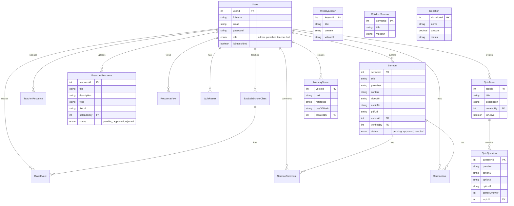

# Database Entity Relationship Diagram

```mermaid
erDiagram
    Users ||--o{ SabbathSchoolClass : "teaches"
    Users ||--o{ TeacherResource : "uploads"
    Users ||--o{ PreacherResource : "uploads"
    Users ||--o{ ClassEvent : "creates"
    Users ||--o{ ResourceView : "views"
    Users ||--o{ QuizResult : "has"
    Users ||--o{ Sermon : "authors"
    Users ||--o{ SermonComment : "comments"
    Users ||--o{ SermonLike : "likes"
    Users ||--o{ QuizTopic : "creates"
    Users ||--o{ MemoryVerse : "creates"

    SabbathSchoolClass ||--o{ ClassEvent : "has"
    
    QuizTopic ||--o{ QuizQuestion : "contains"

    Sermon ||--o{ SermonComment : "has"
    Sermon ||--o{ SermonLike : "has"

    Users {
        int userid PK
        string fullname
        string email
        string password
        enum role "admin, preacher, teacher, kid"
        boolean isSubscribed
    }

    Sermon {
        int sermonid PK
        string title
        string preacher
        string content
        string videoUrl
        string audioUrl
        string pdfUrl
        int authorid FK
        int verifiedBy FK
        enum status "pending, approved, rejected"
    }

    PreacherResource {
        int resourceid PK
        string title
        string description
        string type
        string fileUrl
        int uploadedBy FK
        enum status "pending, approved, rejected"
    }

    QuizTopic {
        int topicid PK
        string title
        string description
        int createdBy FK
        boolean isActive
    }

    QuizQuestion {
        int questionid PK
        string question
        string option1
        string option2
        string option3
        int correctAnswer
        int topicId FK
    }

    MemoryVerse {
        int verseid PK
        string text
        string reference
        string dayOfWeek
        int createdBy FK
    }

    WeeklyLesson {
        int lessonid PK
        string title
        string content
        string videoUrl
    }

    ChildrenSermon {
        int sermonid PK
        string title
        string videoUrl
    }

    Donation {
        int donationid PK
        string name
        decimal amount
        string status
    }
```
