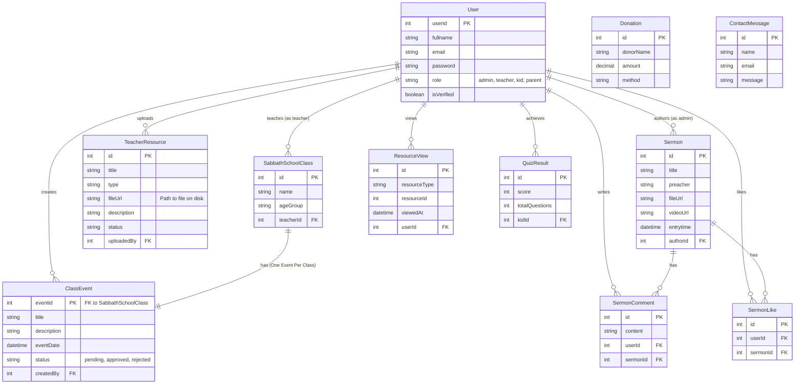

# Database Map (Entity Relationship Diagram)

This diagram visualizes the database structure and relationships between tables.

## Key Constraints
- **One Event Per Class**: The `ClassEvent` table uses `eventid` as its Primary Key, which is also a Foreign Key to `SabbathSchoolClass.id`. This enforces a strict limit of one event per class.
- **Resource Storage**: `TeacherResource` stores the file path in `fileUrl`. Actual files are on the disk in `uploads/teacher-resources`.
