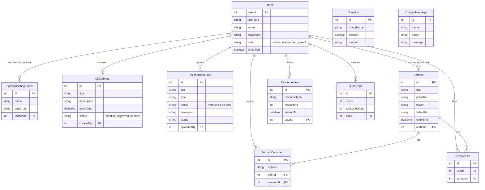

# Database Map (Entity Relationship Diagram)

This diagram visualizes the database structure and relationships between tables.

## Key Constraints
- **Events**: `ClassEvent` table uses `id` as Primary Key. Events are associated with the teacher (`createdBy`) who created them.
- **Resource Storage**: `TeacherResource` stores the file path in `fileUrl`. Actual files are on the disk in `uploads/teacher-resources`.
